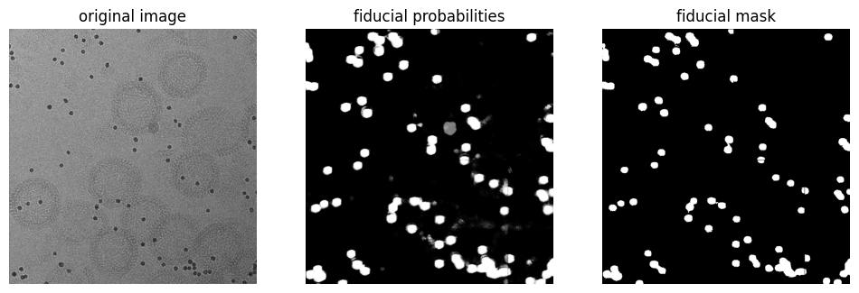

# torch-segment-fiducials-2d

A small pre-trained residual U-Net for gold fiducial segmentation in cryo-EM images.

Documentation available at
[teamtomo.org/torch-segment-fiducials-2d](https://teamtomo.org/torch-segment-fiducials-2d)

  

