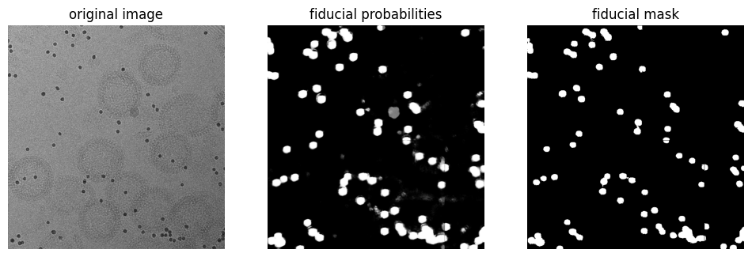

# Overview

*torch-segment-fiducials-2d* contains a small pre-trained CNN for segmenting fiducials in cryo-EM images.

<figure markdown="span">
  { width="600" }
</figure>

## Installation

```python
pip install torch-segment-fiducials-2d
```

## Usage

```python
import tifffile
from torch_segment_fiducials_2d import (
    predict_fiducial_probabilities,  # predicts probability in range [0, 1]
    predict_fiducial_mask            # predicts a binary mask
)

# load image and mask
image = tifffile.imread("image.tif")

# erase masked regions
probabilities = predict_fiducial_probabilities(image=image, pixel_spacing=8)
mask = predict_fiducial_mask(image=image, pixel_spacing=8, probability_threshold=0.8)
```